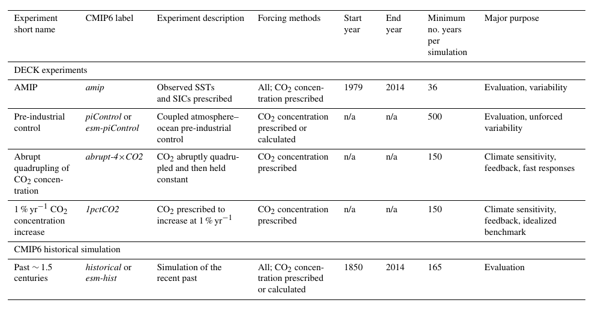

# CMIP6 data

Coupled Model Intercomparison project Phase 6
- Project under World Climate Research Programme (WCRP) 
- Since 1995 CMIP has coordinated climate model experiments 
- Defines common experiment protocols, forcings and output. 
- 33 model groups participate

GMD special issue with articles explaining all MIPs :
https://www.geosci-model-dev.net/special_issue590.html

## Advantages:
- Homogenized and standardized outputs
- Same variable name
- Same experiments

## Experiments (DECK)


## Links:
- Overview: https://www.wcrp-climate.org/wgcm-cmip/wgcm-cmip6
- ES-DOCs: https://search.es-doc.org/
- Database for data request: http://clipc-services.ceda.ac.uk/dreq/index.html
    - Search for variables: http://clipc-services.ceda.ac.uk/dreq/mipVars.html
    - Search for experiments: http://clipc-services.ceda.ac.uk/dreq/experiments.html

## Tool to download from ESGF archive:
- Easiest: https://esgf-node.llnl.gov/search/cmip6/
    Sugestion:
    - Choose a MIP (model intercomparison project) under "Activity" (e.g. CMIP)
    - Choose e.g. "Experiment ID" _historical_ 
    - Choose "Realm" e.g. _aerosol_
        - Press search (this will narrow your further options)
    - If you want a particular model, you can choose this under "Source ID"
    - Now you can use either use "Variable" or "CF Standard Name" to pick out the variable you want.
## Download to Jupyter hub:
    - Click on the "WGET Script" under the variable file you want. 
    - The file will get downloaded to your computer. 
    - Upload it to the Jupyter Hub (you can click and drag the file into your folder)
    - Use a terminal in Jupyter hub and run
        ```bash
        bash wget####.sh -H
        ```
      (Replace wget###.sh by the actual name of your file)
    - When it askes for openid and password, just press "enter". 
    

There are some tools for downloading and manipulating data, but I don't have experience with them.
- Command line tool to search and download files from the ESGF: http://prodiguer.github.io/synda/index.html
- ESMValTool: https://esmvaltool.readthedocs.io/en/latest/index.html
    - Observational data for comparison 
    - CMORification
    - Works with Synda to get model data: https://esmvaltool.readthedocs.io/en/latest/getting_started/inputdata.html
